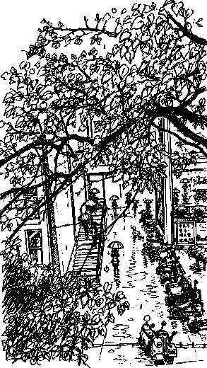
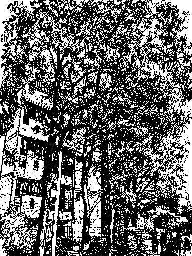

# WonkyInk Reference Gallery

This directory is for visual references and before/after examples that show what WonkyInk is designed to do.

The gallery should make two things obvious:

1. **WonkyInk is not a generic sketch filter.**
2. **Gear changes scene richness, not drawing professionalism.**

## Official environment references

These references demonstrate the intended balance of dense scene observation, irregular hand-drawn contours, and deliberately low local finish.

### Rainy Campus



Demonstrates:

- strong environment retention
- many repeated scene elements such as people, umbrellas, plants, and vehicles
- dense semantic coverage without polished sketch rendering
- lively black-pen marks and imperfect local construction

### Campus Trees



Demonstrates:

- layered foliage and architecture
- high scene information density
- organic, hand-guessed contour behavior
- complex environment coverage without turning local objects into finished drawings

## Recommended comparison structure

For future source-image comparisons, keep the original and several gear outputs:

```text
examples/
└── street-campus/
    ├── source.jpg
    ├── gear-1.jpg
    ├── gear-3.jpg
    ├── gear-5.jpg
    └── README.md
```

## What to compare

When comparing gears, look for:

- Gear 1: simpler, dumber, but still keeps the environment
- Gear 3: balanced scene coverage
- Gear 5: many more observed details while keeping crude local drawing

The key rule:

> Higher gear adds more observed things, not more drawing skill.

## Suggested categories

- `portrait/` — facial attitude and expression preservation
- `street/` — environment richness and repeated objects
- `pet/` — character and gesture preservation
- `interior/` — clutter and background coverage
- `food/` — object simplification without realism
